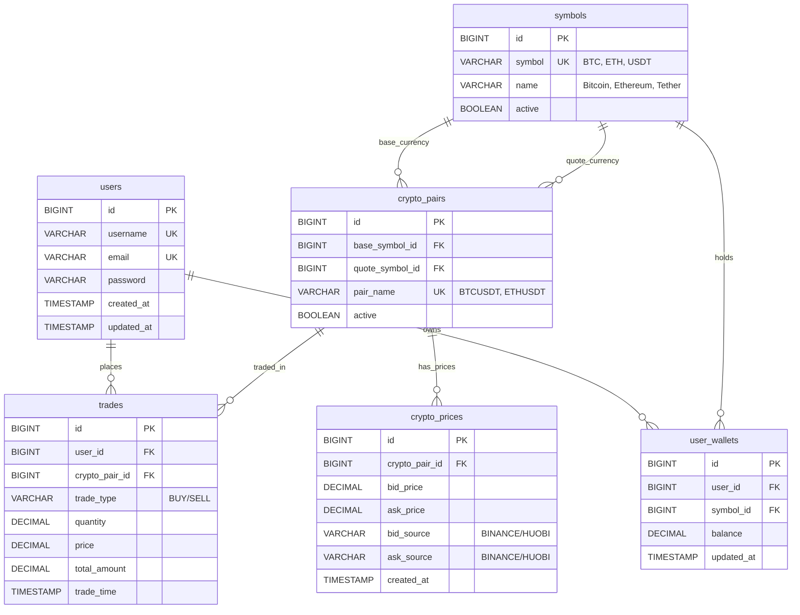

# Database Schema

## Entity Relationship Diagram

### Viewing the Diagram
If the diagram above doesn't render in your editor, you can view it using online Mermaid viewers:

1. Go to https://mermaid.live/
2. Copy the entire code block above (from `erDiagram` to the last relationship line)
3. Paste it into the editor to see the visual diagram

Alternatively, explore the database structure directly using the H2 Console at http://localhost:8080/h2-console once your application is running.

## Table Descriptions

### Core Tables
- **[users](src/main/java/com/aquariux/technical/assessment/trade/entity/User.java)**: User accounts and authentication
  - `username`: VARCHAR(50) UNIQUE
  - `email`: VARCHAR(100) UNIQUE
  - `password`: VARCHAR(255)
- **[symbols](src/main/java/com/aquariux/technical/assessment/trade/entity/Symbol.java)**: Cryptocurrency symbols (BTC, ETH, USDT)
  - `symbol`: VARCHAR(10) UNIQUE
  - `name`: VARCHAR(50)
- **[crypto_pairs](src/main/java/com/aquariux/technical/assessment/trade/entity/CryptoPair.java)**: Trading pairs (BTCUSDT, ETHUSDT)
  - `pair_name`: VARCHAR(20) UNIQUE

### Trading Tables
- **[trades](src/main/java/com/aquariux/technical/assessment/trade/entity/Trade.java)**: Transaction records of buy/sell orders
  - `trade_type`: VARCHAR(4) CHECK ('BUY', 'SELL')
  - `quantity`, `price`, `total_amount`: DECIMAL(20,8)
- **[crypto_prices](src/main/java/com/aquariux/technical/assessment/trade/entity/CryptoPrice.java)**: Real-time price data from exchanges
  - `bid_price`, `ask_price`: DECIMAL(20,8)
  - `bid_source`, `ask_source`: VARCHAR(20)
- **[user_wallets](src/main/java/com/aquariux/technical/assessment/trade/entity/UserWallet.java)**: User cryptocurrency balances
  - `balance`: DECIMAL(20,8)
  - UNIQUE constraint on (user_id, symbol_id)