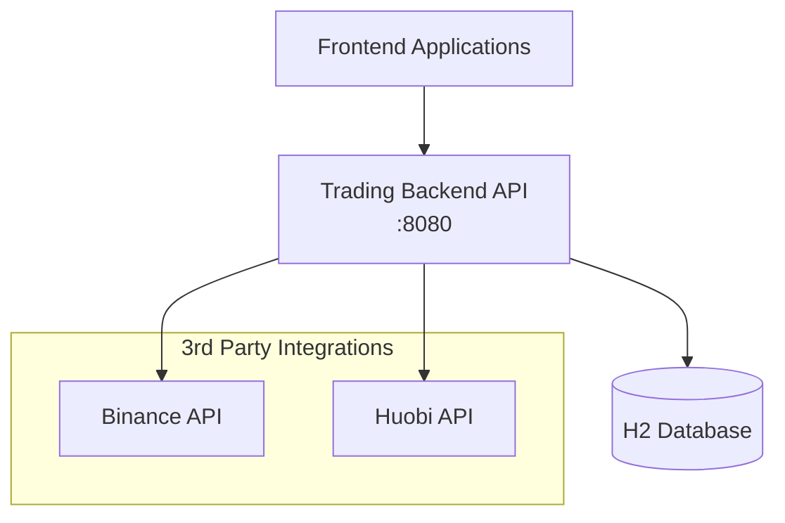

# Application Overview - Aquariux Trading System

A Spring Boot application for cryptocurrency trading with REST APIs, built for technical assessment.

## Architecture Overview



## Database Schema

See [2_DATABASE_SCHEMA.md](2_DATABASE_SCHEMA.md) for detailed entity relationship diagram and table descriptions.

## Technology Stack

- **Framework**: Spring Boot 3.5.7
- **Java**: 21
- **Database**: H2 (in-memory)
- **ORM**: MyBatis 3.0.4
- **Migration**: Flyway
- **Security**: Spring Security 6.x
- **Documentation**: SpringDoc OpenAPI 3
- **Build**: Maven
- **Testing**: JUnit 5, Mockito, AssertJ, JaCoCo

## Application Access

| Service | URL | Description |
|---------|-----|-------------|
| Application | http://localhost:8080 | Main application |
| Swagger UI | http://localhost:8080/swagger-ui/index.html | API documentation |
| H2 Console | http://localhost:8080/h2-console | Database console |

### H2 Database Connection
- **JDBC URL**: `jdbc:h2:mem:aquariux`
- **Username**: `sa`
- **Password**: (empty)

## Functional Requirements

### Core Features
- 🚧 **Buy/Sell Crypto**: Trade execution API (to be implemented)
- ✅ **Transaction History**: Database schema ready for trading transactions
- ✅ **Wallet Balance**: Check cryptocurrency wallet balances

### API Endpoints
- `POST /api/trades/execute` - Execute buy/sell orders ([TradeController](src/main/java/com/aquariux/technical/assessment/trade/controller/TradeController.java))
- `GET /api/wallets/user/{userId}` - Get user's wallet balances ([WalletController](src/main/java/com/aquariux/technical/assessment/trade/controller/WalletController.java))
- `GET /api/prices/latest` - Get latest best prices for all crypto pairs ([PriceController](src/main/java/com/aquariux/technical/assessment/trade/controller/PriceController.java))

## Project Structure

```
src/main/java/com/aquariux/technical/assessment/trade/
├── config/          # Configuration classes
│   ├── OpenApiConfig.java
│   ├── SecurityConfig.java
│   └── SchedulerConfig.java
├── controller/      # REST Controllers
│   ├── WalletController.java
│   ├── PriceController.java
│   └── TradeController.java
├── dto/             # Data Transfer Objects
│   ├── request/
│   │   └── TradeRequest.java
│   ├── response/
│   │   ├── WalletBalanceResponse.java
│   │   ├── BestPriceResponse.java
│   │   └── TradeResponse.java
│   └── internal/
│       └── UserWalletDto.java
├── entity/          # Database entities
│   ├── User.java
│   ├── Symbol.java
│   ├── CryptoPair.java
│   ├── CryptoPrice.java
│   ├── Trade.java
│   └── UserWallet.java
├── enums/           # Enumerations
│   └── TradeType.java
├── mapper/          # MyBatis Mappers
│   ├── UserWalletMapper.java
│   ├── CryptoPairMapper.java
│   ├── CryptoPriceMapper.java
│   └── TradeMapper.java
├── scheduler/       # Scheduled Tasks
│   └── PriceUpdateScheduler.java
├── service/         # Business Services
│   ├── WalletServiceInterface.java
│   ├── PriceServiceInterface.java
│   ├── TradeServiceInterface.java
│   └── impl/
│       ├── WalletServiceImpl.java
│       ├── PriceServiceImpl.java
│       └── TradeServiceImpl.java
└── TradeApplication.java

src/main/resources/
├── db/migration/    # Flyway migrations
│   ├── V1__Create_trading_schema.sql
│   ├── V2__Data_prep_for_price.sql
│   ├── V3__Data_prep_for_users.sql
│   └── V4__Data_prep_for_trades.sql
└── application.yml  # Application configuration

src/test/java/com/aquariux/technical/assessment/trade/
├── service/impl/    # Service Unit Tests
│   ├── PriceServiceImplTest.java
│   ├── WalletServiceImplTest.java
│   └── TradeServiceImplTest.java (to be implemented)
└── TradeApplicationTests.java
```